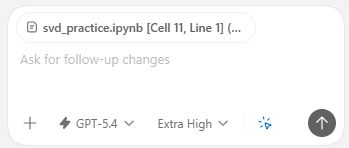
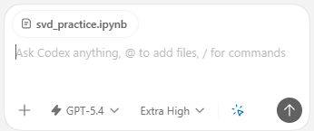

# Codex Context Bridge

`Codex Context Bridge` is a local VS Code extension that restores `Ctrl+L` and `Ctrl+Shift+L` context attachment for editors that are not backed by a normal `file:` URI.

It exists for cases like:

- notebook cells opened as `vscode-notebook-cell`
- VS Code profile files such as `keybindings.json` opened as `vscode-userdata`
- other virtual editors where the stock `chatgpt.addToThread` command silently does nothing

## Why This Exists

The OpenAI Codex VS Code extension handles selected-line attachment through `chatgpt.addToThread`, but that path only works for file-backed editors.

This bridge keeps the default Codex behavior whenever it can:

- normal files still go through the native OpenAI commands
- non-file editors fall back to a temporary snapshot file
- full-document attach stays visually minimal
- partial selection attach keeps enough cell or line metadata to stay useful

## Visual Examples

Selection attach from a notebook cell or VS Code profile JSON:



Full-document attach from a non-file editor:



## Behavior

`Ctrl+L`

- For `file:` editors, delegates to the native `chatgpt.addToThread` command.
- For non-file editors, creates a temporary snapshot such as `keybindings.json [Lines 12-18].md` or `svd_practice.ipynb [Cell 8, Line 1].md`.

`Ctrl+Shift+L`

- For `file:` editors, delegates to the native `chatgpt.addFileToThread` command.
- For non-file editors, attaches the whole document through a temporary snapshot that uses only the source filename, for example `svd_practice.ipynb`.

## Snapshot Lifecycle

The bridge writes temporary files only for non-file editors.

- Snapshots live under `%USERPROFILE%\.codex-context-bridge\snapshots`
- Each VS Code session gets its own snapshot folder
- Repeated attachments for the same source and selection reuse the same snapshot path
- Reattaching updates the snapshot content in place instead of creating numbered duplicates
- The current session folder is deleted when the extension session ends
- Session folders older than one day are removed on startup
- Legacy loose files under the snapshot root are removed on startup

This keeps the behavior simple:

- selected snippets remain readable in Codex
- whole-document chips stay clean
- snapshot files do not accumulate indefinitely under normal use

## Repository Layout

- `package.json`: local extension manifest
- `extension.js`: command bridge and session-scoped snapshot handling
- `lib/snapshot.js`: snapshot naming and content rules
- `scripts/install.ps1`: installs the extension and updates keybindings
- `scripts/smoke-test.ps1`: validates extension registration and keybinding wiring
- `tests/snapshot.test.js`: Node-based unit tests for snapshot formatting
- `docs/assets/`: README illustrations

## Install Or Reapply

Run this after a Codex extension update or when reinstalling the bridge:

```powershell
powershell -ExecutionPolicy Bypass -File .\scripts\install.ps1
```

Then reload VS Code with `Developer: Reload Window`.

## Keybindings

The installer writes these bindings:

- `Ctrl+L` -> `codexContextBridge.addSelectionToThread`
- `Ctrl+Shift+L` -> `codexContextBridge.addActiveDocumentToThread`

## Notes

- `README.md`, `.py`, and other normal files still use the native Codex flow. That is why they can show the cleaner built-in chip from the OpenAI extension.
- The bridge only activates when the native extension cannot attach context because the active editor is not file-backed.
- This repository is a local workaround, not an official OpenAI project.

## Test Commands

```powershell
node .\tests\snapshot.test.js
powershell -ExecutionPolicy Bypass -File .\scripts\smoke-test.ps1
```
